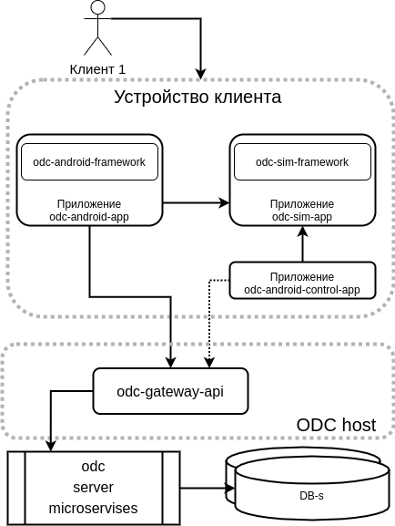
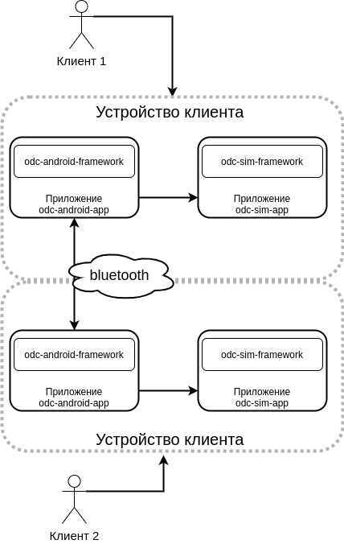

# odc-doc

Проект по документации Open Digital Cash проекта. 

<b>Описание proof of consept проекта смотри тут: ... </b>
Здесь и далее описание ODC полноценного проекта.

## О цифровой наличности

TODO

## Основная информация об ODC

<b>Open Digital Cash (ODC)</b> 
это студенческий проект [Клуба Информационной Безопасности](https://t.me/kibinfo). 
Основная цель проекта — учебная. 

### [Электронный] кошелёк (e-wallet)

Кошелёк в ODC представляет собой защищённое Android приложение.
Ключи к самому кошельку, а так же криптографические функции
расположены внутри самой SIM карты. 

<b>Важное замечание: SIM карта прошивается полностью и поддерживает только odc-sim-app приложение. Таким образом целая SIM карта выделяется под ODC приложение. </b>

Приложение для кошелька можно взять стандартное 
(см. odc-android-app) или разработать его самостоятельно, 
используя наш фреймворк (odc-android-framework).

Для самостоятельной разработки мобильного приложения
мы разработали очень простое приложение odc-dummy-android-app, 
в котором отсуствует дизайн и удобство пользования. 
Приложение  odc-dummy-android-app создано как пример пользования 
odc-android-framework фреймворком

## Взаимодействия

ODC позволяет осуществить два вида взаимодействия
1. **клиент-сервер** — передача цифровой наличности от банкомата (сервер) электронному кошельку, передача служебной информации от устройства клиента 
в центр обработки данных (сервер).
1. **клиент-клиент** — передача цифровой наличности между клиентами. 
Особенность ODC в том, что передача происходит **без подключения** к сети интернет.

### Клиент-сервер

### Клиент-клиент

