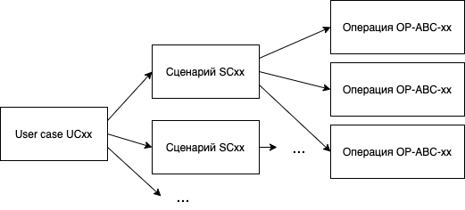

# odc-doc

Проект по документации Open Digital Cash проекта. 

Канал в Telegram: https://t.me/odc_kib

# docusaurus

См [README.docusaurus.md](README.docusaurus.md)

# proof-of-consept

См. тут: https://github.com/kib-sources/odc-poc

# ODC v.1.0

Первая реализация pet цифровых наличных Open Digital Cash (ODC)

Исходники первой "наколеночной" версии:
* https://github.com/kib-sources/odc-raspberry-app
* https://github.com/kib-sources/odc-android-app
* https://github.com/kib-sources/odc-pseudo-sim
* https://github.com/kib-sources/odc-kotlin-core
* https://github.com/kib-sources/odc-kotlin-server

Вот что получилось:

 Если видео не отображается, перейдите по ссылке: https://www.youtube.com/watch?v=38J_q7Re6SI 

# ODC v.2.*

## Сокращения

См. страницу [definitions.md](definitions.md)

## Бизнес-сценарии (user cases), сценарии, операции

Иерархия процессов:
1. [User cases](user_cases/README.md) -- бизнес-сценарии ODC
2. [Сценарии](scenarios/README.md) -- step-by-step сценарии 
с описанием шагов и диаграммами взаимодействий компонентов системы
3. [Операции](operations/README.md) -- конкретные операции,
реализованные через REST или Kafka взаимодействия.
Внутриние операции в рамках каждого компонента описаны внутри самого компонента
и не требуют описания в рамках **odc-doc**.

В редких случаях один сценарий применим к нескольким юзеркейсам.
Одна операция достаточно часто может выступать в рамках различных 
сценариев.

Нумерация UC и SC -- сквозная.

Нумерация операций имеет вид OP-ABC-xx, где ABC 
-- аббревиатура компонента. Например OP-FRW-01 или OP-AIT-05.

## Архитектура

Всего предусмотрены следующие стороны:
1. Кошельки -- это Android или iOS устройства,
на которых установлены специальные приложения 
(odc-android-app \ odc-ios-app)
и вставлены специальные SIM карты 
(odc-sim-wallet).
2. Банкоматы и Системы Управления Банкоматов (СУБ)
3. Процессинг

Архитектура см на страницах:
* [C1](arch/C1.md)
* C2 -- TODO

C3 архитектуру смотри в рамках README.md каждого компонента.
Описание С4 архитектуры отсуствует -- читай код. 

## Компоненты системы

Сеть:
1. public -- возможность выхода в публичные сети (в том числе интернет)
2. protected -- выход в публичные сети (интернет) отсуствует, есть внутренняя
сеть. Само устройство доступно для физического взаимодействия с public клиентами
3. private -- выход в публичные сети (интернет) отсуствует, есть внутренняя
сеть. Само устройство не доступно для физического взаимодействия с public клиентами.

| Компонент, (префикс) | Комментарий | Сеть | Ссылка на C3 архитектуру |
| -------- | ---------- | ----------- | ---------- |
| odc-sim-wallet (SIM) | Приложение для SIM карты | public | ...|
| odc-android-app (APP)| Приложение "Кошелёк" для Android | public | ... |
| odc-ios-app (APP)| Приложение "Кошелёк" для iOS | public | ... |
| odc-gateway-api (API)| Шлюз для запросов к процессингу ODC | 3 независимых инстанса: public, protected, private|
| odc-android-framework (FRW) | Фреймворк для удобного взаимодействияс odc-sim-wallet, odc-android-app, odc-gateway-api| public | ... | 
| odc-ios-framework (FRW)| Фреймворк для удобного взаимодействияс odc-sim-wallet, odc-ios-app, odc-gateway-api| public | ...
| odc-authorization (AUT)| Микросервис для активации, аутентификации и авторизации кошельков, токен-кошельков и СУБ | private | ... |
| odc-inventory (INV) | Инвентаризация блокчейнов в рамках каждой банкноты. При первом доступе в сеть все новые блокчейны для каждой банкноты отправляются на инвентаризацию | private | ... |
| odc-audit (AIT)| Система аудита. Блокировка мошеннических кошельков | private|  ... |
| odc-issuance (ISS) | Система выпуска новых банкнот, а так же утилизация старых | private | ... |
| odc-exchange (EXC)| Система для [эксченджа](user_cases/uc16.md) | private | ...
| odc-savings (SAV) | Сберегательная касса для клиентов | private | ... |
| odc-admin (ADM) | Панель администратора процессинга ODC системы | private | ... | 
