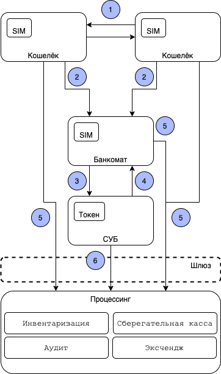

## C1 архитектура

Всего предусмотрены следующие стороны:
1. Кошельки -- это Android или iOS устройства,
   на которых установлены специальные приложения
   (odc-android-app \ odc-ios-app)
   и вставлены специальные SIM карты
   (odc-sim-wallet).
2. Банкоматы и Системы Управления Банкоматов (СУБ)
3. Процессинг

Пояснения:
1. Кошельки могут передавать друг другу банкноты ([UC14](../user_cases/uc14.md)). 
Это основной бизнес-сценарий ODC системы.
2. Вы можете физически подойти к банкомату и по bluetooth получить цифровые наличные в обмен на физические наличные
3. В случае переполнения стойки с физическими наличными банкомат может затребовать их у СУБ
4. СУБ время от времени пингует банкоматы на работоспособность
5. Кошельки и банкоматы проводят инвентаризацию, помещают/берут деньги из сберегательной кассы, совершают эксчендж.
6. СУБ может проводить аудит + все те же действия что и обычный кошелёк. 
