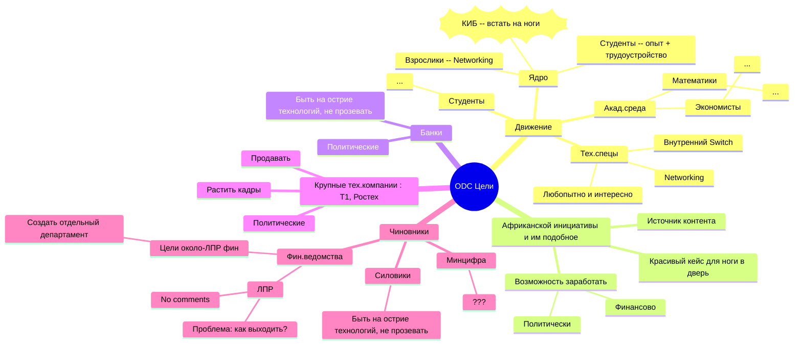
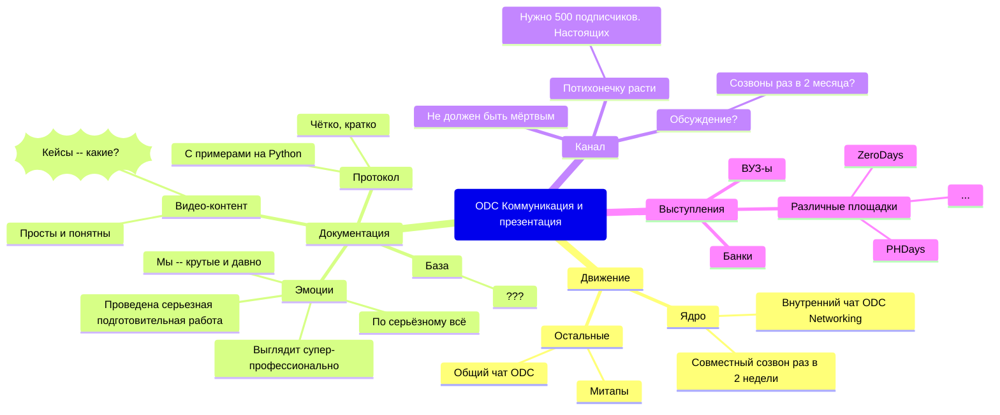
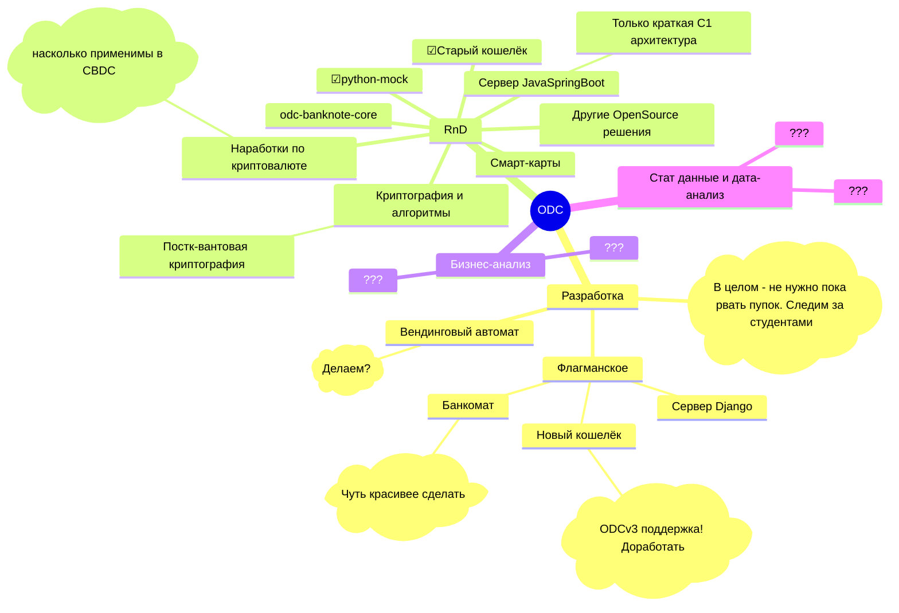

# MindMap

## Целеполагание

## Коммуникация и презентация результатов 

## Разработка и исследования

## Текущие задачи

Обсудим на звонке 22.01.2024 и поправим.

### 1. "выход из тени"

Про нас должны знать.

Выступления-выступления-выступления

Крутая документация

Уже можно искать партнёров (например Африканская инициатива)
и аккуратно "принюхиваться" к крупняку

Чиновники -- ???

### 2. Позиционирование

КИБ создаёт ODC Foundation как отдельную некоммерческую структуру

КИБ часть Foundation с пожизнинным членством и отсутствием регулярных выплат. 
КИБ "платит" кадрами.

Цель ODC Foundation -- распространение ODCv3, набивание шишек и создание ODCv4.

Паралельно на двух уровнях растёт Networking:
* ODC Foundation  -- формальный
* КИБ -- неформальный "в узком кругу" специалистов
* множество других кружков

Так же можно и нужно делать коммерческую реализацию на заказ.

### 3. Политические вопросы

Они ОЧЕНЬ важны. 

Тут нужен баланс и правильные партнёры. Не текстом. 

### 4. Первые шаги

В ближайшее время:
1. Допиливаем документацию до "сырого, но серьезного вида"
2. Делаем все видео !
3. Проводим 2-3 выступлений в ВУЗ-ах и 2-3 в банках, в "доверенном кругу"
4. Сбор след.контактов.

Дедлайн -- апрель 2025.

Далее очно встречаемся и думаем.

