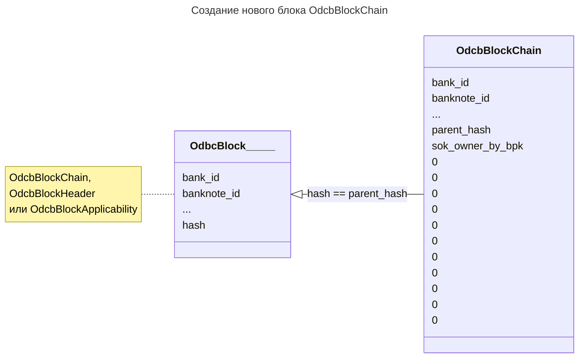

#  Broadcast алгоритм

Данный алгоритм запускается после
взаимной аутентификации
и
обмена множеством банкнот
между *отправителем* и *получателем*.

Данный алгоритм
меняет в рамках множества 
банкнот владельца. Старый владелец (отправитель)
меняется на новго владельца (получателья).
В случае сдачи -- наоборот. Права переходят от получателя к отправителю.

Чтобы не запутаться,
можно рассмотреть алгоритм **без сдачи**,
для этого подпараграфы "Режим со сдачей"
следует опустить.

## Создание нового блока и вызов receive_banknote_step1

Выполняется на стороне **получателя**

Возмём банкноту c неким `banknote_id`.

**Получатель** создаёт новый блок
[`OdcbBlockChain`](../block-chain.md),
который ссылается на предыдущий блок.

По итогу:
1. Заполнены поля `bank_id`, `banknote_id`, `parent_hash`, `sok_owner_by_bpk`.
2. Другие поля не заполнены для нового `OdcbBlockChain`

:::note[Замечание]
Предыдущий блок может быть так же 
`OdcbBlockChain` блоком,
либо блоком заголовка `OdcbBlockHeader`,
либо блоком применимости `OdcbBlockApplicability`.

Значение `parent_hash`
нового блока равно значению
`hash`
предыдущего.

Таким образом осуществляется
[блокчейн](../../../dc/3-crypto/blockchain/dc.md)
в рамках каждой банкноты

:::

В рамках одной банкноты
схематично это можно представить в виде:

- - - 

Затем для блока вызывается функция 
[receive_banknote_step1](../../07-functions/receive-banknote-step1.md)

По итогу:
1. Заполнены поля `counter`, `salt0`, `hash0` и `hash0_by_spk_owner` у нового блока
2. В [Banknote-Counter словаре](../../03-architecture/wallet/banknote-counter-dict.md) получателя появилась новая пара (`bankote_id`, `counter`)
3. Другие поля не заполнены для нового `OdcbBlockChain`

:::tip[важно]

Данная процедура проходит для 
КАЖДОЙ передаваемой банкноты.

:::

Таким образом внутри доверенной среды получателя 
сформировались разлиыные новые поля
в [Banknote-Counter словаре](../../03-architecture/wallet/banknote-counter-dict.md).

В рамках одной банкноты
схематично это можно представить в виде:

TODO

- - - 

Все новые блоки передаются от отправителя 
к получателю.

### Режим со сдачей

Если есть сдача, то аналогичное действие
делает **отправитель**. 
Тут отправитель и получатель меняются местами. 

:::warning[Замечание.]

В передачах блока на этом и последующих шагах
сначала все блоки передаёт **отправитель** получателю,
а затем **получатель** отправителю.

Сделано это по следующей причине. 
Обычно
отправитель -- покупатель, 
получатель -- продавец.

Так как продавец "прикреплён к месту"
продажи, он скорее всего не склонен убежать. 

Покупатель, теоретически может получить сдачу 
и, не отдать основные деньги.

В этом случае покупатель обманет продавца.

:::

## 
