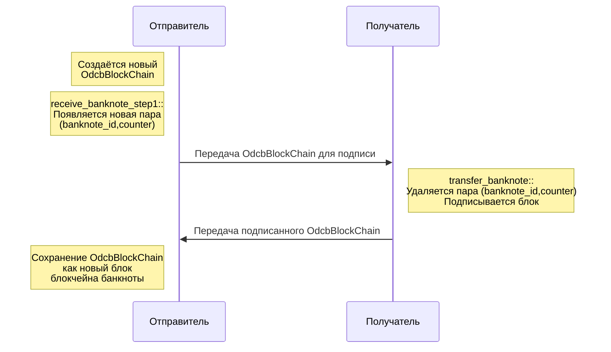
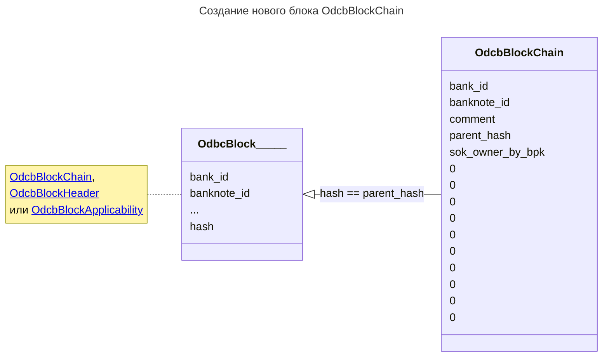
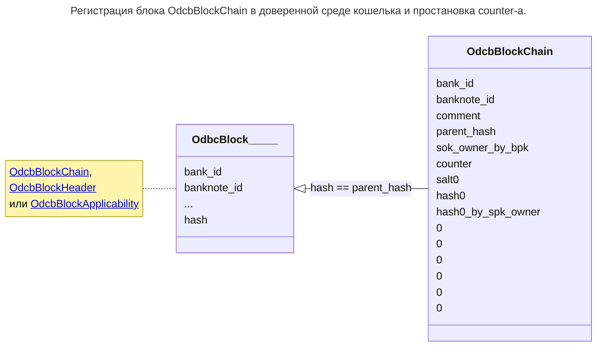
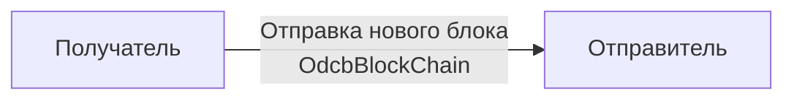
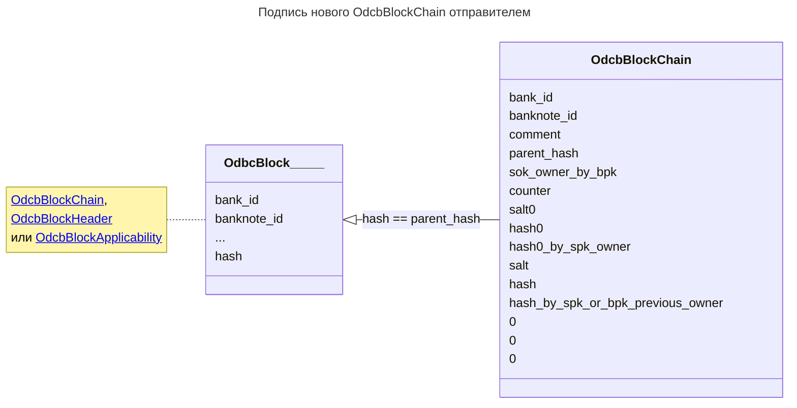
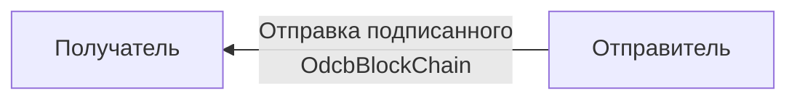

#  Broadcast алгоритм

Данный алгоритм запускается после
взаимной аутентификации
и
обмена множеством банкнот
между *отправителем* и *получателем*.

Данный алгоритм
меняет в рамках множества 
банкнот владельца. Старый владелец (отправитель)
меняется на новго владельца (получателья).
В случае сдачи -- наоборот. Права переходят от получателя к отправителю.

Чтобы не запутаться,
можно рассмотреть алгоритм **без сдачи**,
для этого подпараграфы "Режим со сдачей"
следует опустить.

:::tip[Важно]
Алгоритм работает 
в offline режиме,
в отличие от большинства других аналогичных
алгоритмов CBDC протоколов.
:::

## Схема алгоритма

Алгоритм состоит из трёх шагов:
1. [Создание новых блоков владения получателем (инициация)](#1-создание-новых-блоков-владения-получателем-инициация-)
1. [Подпись банкнот отправителем](#2-подпись-банкнот-отправителем)
1. [Фиксация новых блоков владения](#3-фиксация-новых-блоков-владения)

Ниже расписана схема (без "режима со сдачей")
для одной банкноты

## 1. Создание новых блоков владения получателем (инициация) 

Выполняется на стороне **получателя**

Все операции 
`1`, `2`, `3` 
выполняются для **каждой** банкноты.

### 1.1 Создание нового OdcbBlockChain

Возмём банкноту c неким `banknote_id`.

**Получатель** создаёт новый блок
[`OdcbBlockChain`](../block-chain.md),
который ссылается на предыдущий блок.

По итогу:
1. Заполнены поля `bank_id`, `banknote_id`, `parent_hash`, `sok_owner_by_bpk`.
2. (опционально) можно заполнить поле `comment` -- произвольный комментарий.
3. Другие поля не заполнены для нового `OdcbBlockChain`

:::note[Замечание]
Предыдущий блок может быть так же 
`OdcbBlockChain` блоком,
либо блоком заголовка `OdcbBlockHeader`,
либо блоком применимости `OdcbBlockApplicability`.

Значение `parent_hash`
нового блока равно значению
`hash`
предыдущего.

Таким образом осуществляется
[блокчейн](../../../dc/3-crypto/blockchain/dc.md)
в рамках каждой банкноты

:::

В рамках одной банкноты
схематично это можно представить в виде:

### 1.2. receive_banknote_step1

Затем для блока вызывается функция 
[receive_banknote_step1](../../07-functions/receive-banknote-step1.md)

По итогу:
1. Заполнены поля `counter`, `salt0`, `hash0` и `hash0_by_spk_owner` у нового блока
2. В [Banknote-Counter словаре](../../03-architecture/wallet/banknote-counter-dict.md) получателя появилась новая пара (`bankote_id`, `counter`)
3. Другие поля не заполнены для нового `OdcbBlockChain`

:::tip[важно]

Данная процедура проходит для 
КАЖДОЙ передаваемой банкноты.

:::

Таким образом внутри доверенной среды получателя 
сформировались разлиыные новые поля
в [Banknote-Counter словаре](../../03-architecture/wallet/banknote-counter-dict.md).

В рамках одной банкноты
схематично это можно представить в виде:

### 1.3. Передача данных

Все новые блоки передаются от 
**получателя** 
к 
**отправителю**.

- - - -
### Режим со сдачей

Если есть сдача, то аналогичные шаги 
делает **отправитель**. 

Тут отправитель и получатель меняются местами.

Осуществляются шаги
`1`, `2`, `3`,
для каждой банкноты из сдачи.

:::warning[Замечание.]

В передачах блока на этом и последующих шагах
сначала все блоки передаёт **отправитель** получателю,
а затем **получатель** отправителю.

Сделано это по следующей причине. 
Обычно
отправитель -- покупатель, 
получатель -- продавец.

Так как продавец "прикреплён к месту"
продажи, он скорее всего не склонен убежать. 

Покупатель, теоретически может получить сдачу 
и, не отдать основные деньги.

В этом случае покупатель обманет продавца.

:::

## 2. Подпись банкнот отправителем

Шаг осуществляется на стороне **отправителя**.

### 2.1. transfer-banknote

Для каждой из банкнот
**отправитель**
вызывает функцию
[transfer-banknote](../../07-functions/transfer-banknote.md)
(шаг `1`)

По итогу:
1. Заполнены поля `salt`, `hash` и `hash_by_spk_or_bpk_previous_owner` у нового блока
2. В [Banknote-Counter словаре](../../03-architecture/wallet/banknote-counter-dict.md) отправителя удалилась новая пара для `bankote_id`.
3. Другие поля не заполнены для нового `OdcbBlockChain`

:::note[Обратите внимание]
На предыдущем шаге
мы **записали** пару (`bankote_id`, `counter`)
в [Banknote-Counter словаре](../../03-architecture/wallet/banknote-counter-dict.md)
**получателя**;
а на данном шаге 
мы удалили
по ключу `bankote_id`
в *Banknote-Counter словаре*
у **отправителя**.
:::

:::warning[Замечание]
Процедура [transfer-banknote](../../07-functions/transfer-banknote.md)
**не может быть вызвана повторно**,
потому что 
ключ `banknote_id`
в [Banknote-Counter словаре](../../03-architecture/wallet/banknote-counter-dict.md)
**отправителя**
удалён при передаче банкноты.

Таким образом обеспечивается
[атомарность передачи](../../../dc/2-money/index.md#атомарная-операция-передачи).

*Banknote-Counter словарь*
помещён в
[доверенной среде](../../03-architecture/wallet/index.md#доверенная-среда)
кошелька
и не может быть произвольно перезаписан.
:::

Схематично "хвост"
банкноты можно 
представить в виде:

:::tip[Важно]
С этого момента меняется владелец банкноты.
Однако новый владелец (получатель)
пока не может это подтвердить,
так как подписанный отправителем
новый блок `OdcbBlockChain`
ещё
**не передан**.
:::

### 2.2. Передача данных

Все новые блоки передаются от
**отправителя**
к
**получателю**.

## 3. Фиксация новых блоков владения

Получатель 
принял подписанные новые блоки
`OdcbBlockChain`.

Пока соотвествующие
(`banknote_id`, `counter`)
пары 
находятся в его
[Banknote-Counter словаре](../../03-architecture/wallet/banknote-counter-dict.md)
-- банкноты его.

Нужно только в 
[index.md](../../03-architecture/wallet/index.md)

### 3.1. receive_banknote_step2

Для каждой банкноты
вызывается
[receive-banknote-step2.md](../../07-functions/receive-banknote-step2.md)

По итогу:
1. в [среде приложения](../../03-architecture/wallet/index.md#среда-приложения)
появились записи о банкнотах

:::note[Обратите внимание]
Если после первого шага
(`receive_banknote_step1`)
связь прервётся,
то в доверенной среде,
а именно в
[Banknote-Counter словаре](../../03-architecture/wallet/banknote-counter-dict.md)
появятся записи
(`banknote_id`, `counter`),
но они будут отсутствовать
в [среде приложения](../../03-architecture/wallet/index.md#среда-приложения).

В этом случае, 
чтобы не занимать места,
следует удалить ключи из
*Banknote-Counter словаря*
спустя некоторое время.
:::