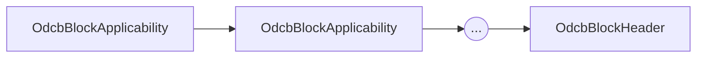
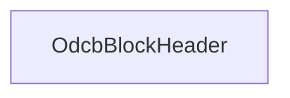

# Эмиссия

## Создание и подпись блоков

При эмиссии банкноты, создаётся блокчейн
состоящий из одного
[блока заголовка](header.md)
и последовательно 
идущих друг за другом
[блоков применимости](applicability.md).



При этом *блоков применимости* может не быть вовсе.
В этом случае банкнота состоит только из одного блока --
*заголовка*.




Блоки связываются по полю `hash`, 
на которые ссылается `parent_hash` 
следующего блока.

Поле `hash` каждого блока последовательно
подписывается приватным ключём `bpk`.
Подпись сохраняется в поля `bang_sign`
каждого блока.

Публичный ключ `bok` 
выступающий парой к приватному `bpk`
доступен 
[в заголовке](header.md).

:::note[Для информации]
Ключ `bok` одинаков и несменяем в рамках всей банкноты.
Если банк хочет с помощью `mpk` подписать новые ключи
(`bpk`,`bok`), то они будут действовать в рамках новой эмиссии.
Старые банкноты используют старые (`bpk`,`bok`) пары.
:::

## Безопасность

Безопасность эмиссии гарантируется 
приватностью ключа `bpk`, 
который используется для подписи
банкнот.

Сам `bok` 
валилидируется через подпись,
хранящайся в кошельке:
```
[hash(bok)](mpk)
```
Подробнее тут: 