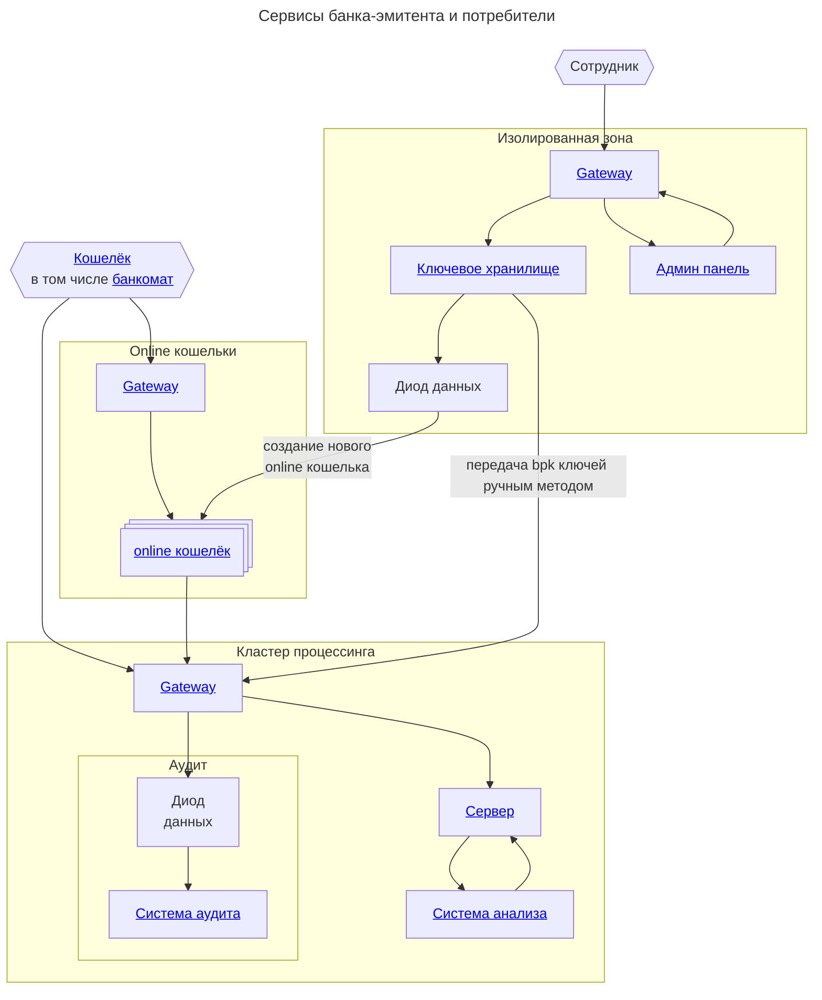

# Банк-эмитент

Банк-эмитент -- это центральный узел
ODC переводов.

На 
[сервер](server.md)
банка-эмитента
поступают различные запросы
ODCv3 протокола,
для обслуживания различных 
[кошельков](../wallet/index.md).

Банк-эмитент:
1. Создаёт новые кошельки, генерирует (`spk`, `sok`) для доверенной среды кошелька
2. Осуществляет эмиссию новых банкнот
3. Осуществляет дополнительную подпись для online платежей
4. Осуществляет эксчендж банкнот
5. Реализует возможность доступа к онлайн кошелькам своих клиентов
6. Подписывать или отзывает подписи для `mok`-ов сторонних банков.
7. Обнаруживает фальшивомонетчиков и уведомляет остальные кошельки об этом.

## Схема

Схематично банк-эмитент можно представить следующей схемой

:::note[Замечание]
Базы данных и брокеры сообщений никак не отображены на схеме.

Вы вольны выбирать любые СУБД и брокеры сообщений по своему усмотрению.
:::

Банк-эмитент реализует функционал:
1. Сервер 
2. Система анализа
3. Система аудита
4. Ключевое хранилище
5. Админ панель

### Диод данных

TODO
