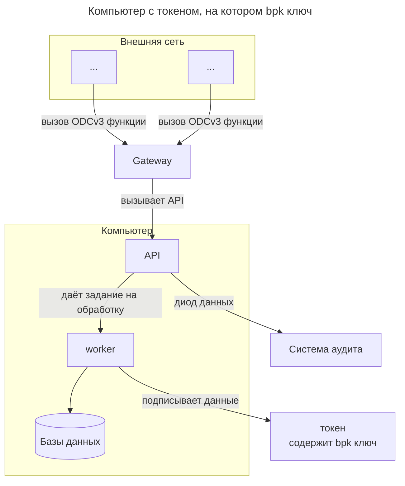

# Ключевое хранилище

Ключевое хранилище -- это отдельные 
от сети Интернет сервера, 
на которых размещены 
ключи `mpk` или `bpk`.

Часть [Банка-эмитента](index.md)

Протокол ODCv3 никак не регламентирует
сами технологии серверов,
вы можете использовать
Linux, BSD и другие серверные мощности.

Однако в рамках протокола
вы обязаны соблюдать несколько принципов.

# Принципы, входящие в работу ключевого хранилища

## Полная изоляция mpk ключевого хранилища

Компьютер, 
содержащий `mpk` ключ изолирован и от  сети Интернет и от любой другой сети. Данный компьютер используется только для гененирования новых ключей (`bok`, `bpk`).

Резервные копии с `mpk` ключом так же должны не быть подключёнными к сети,
а так же к вычислительной технике, физически подключённой к сети.

Данный компьютер используется
только для генерирования новых пар `bpk`, `bok` ключей.
Эти пары переносятся с данного компьютера на другие 
с помощью токенов 

## Изолированность bpk ключей и система аудита

Ключ `bpk`
храниться в специальном устройстве-токене
и не может быть физически извлечён из токена,
за исключением случаев,
когда (`bpk`, `bok`) 
ключи используются для 
[sign_hash_bank](../../functions/sign-hash-bank.md)
функции.

:::note[Замечание]
Возможность не хранить на токене `bpk`
для подтверждения блокчейн операций
обусловлена высокой нагрузкой на систему.

Это может потребовать масштабирование
обрабатываемых мощностей.

Мы рекомендуем для подписи блоков использовать одни
(`bpk`, `bok`) ключи,
а для эмиссии банкнот и создания кошельков -- другие.
:::

Между самим компьютером
и сетью должен стоят промежуточный
**Gateway** который транслирует
ODCv3 функции на компьютер и с него.
Все остальные пакеты **Gateway**
игнорирует.

:::warning[Замечание]
Обращаем внимание, что
**Gateway**
представляет собой отдельное устройство:
компьютер\маршрутизатор,
а не просто программу (например firewall). 
:::

Связь между компьютером и **Gateway**,
между **Gateway** и внешней сетью
должна осуществляться только по проводам.
Запрещена безпроводная передача данных.

В случае с токеном,
схематично можно представить компьютер в виде.

Система аудита необходима для контроля и анализа
всех задач, которые поступают на компьютер.
В случае сбоя, вы сможете постфактум определить
количество эмиссионных денег и созданных
SMART-card кошельков.

:::warning[Замечание]
Основная задача **Gateway** быть дополнительным
физически выделенным компьютером
между основным компьютером для вычислений
и внешней сетью.

Это усложняет работу хакеров.

**Gateway** пропускает
запросы только связанные с протоколом ODCv3.
:::

## Запрет на использование виртуальных серверов

Компьютер хранения `mpk` представляет собой 
физически отдельный компьютер.

Аналогично компьютер с `bpk`
ключами, за исключением случаев
если `bpk` ключ используется только для 
функции [sign_hash_bank](../../functions/sign-hash-bank.md).

Компьютер **Gateway**
так же должен представлять собой отдельно стоящее физически устройство.

## Перенос bpk ключей для sign_hash_bank функций.

Если пара (`bpk`, `bok`)
создана для [sign_hash_bank](../../functions/sign-hash-bank.md)
функции,
то и переносить её можно не в токене, 
а на съёмном носителе ("флешке").

В этом случае перед записью на диск, 
данные ключи должны быть зашифрованы 
ассиметричным алгоритмом шифрования.
Ключ\пароль не следует нигде менять.

После переноса, 
если это HDD носитель, 
он должен быть полностью вычещен 
средствами гарантированного уничтожения информации.
В случае если это не HDD носитель,
а например SSD, данный носитель должен быть уничтожен. 

:::danger[]
Это важное условие, 
так как при "файловом удалении" 
информации, сама информация не удаляется,
удаляется лишь ссылка на неё.

В случае Flash памяти, информацию 
**гарантированно** уничтожить невозможно.

:::

## Необходимо, но не достаточно

:::warning[Замечание]
Обращаем внимание, 
что всё вышенаписанное 
**необходимо** для соблюдения ODCv3 протокола,
но не достаточно.

Построение безопасносй архитектуры 
не входит в сам протокол ODCv3. 

Но базовые принципы для ключевых хранилищ,
описанные на этой странице -- являются минимумом, 
необходимые к соблюдению.
:::

## См.также

* [Ключи системы, хеш-функции, подписи](../../information-security/keys.md)
