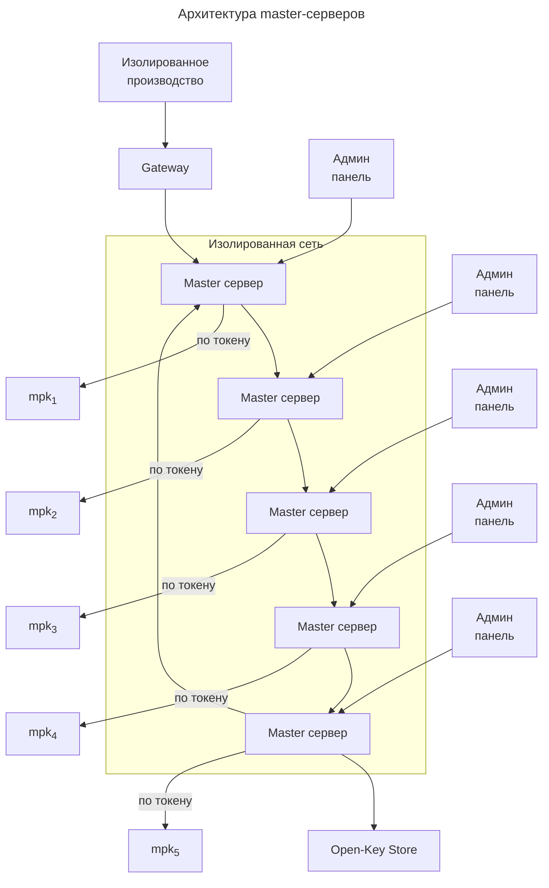

# Мастер сервер

*Мастер сервер*
используется
только для одной единственной функции:
подписи `bpk` ключей.

Сами `bpk` ключи могут использоваться:
1. Для online процессинга (см.[сервер](server.md))
2. Для производства доверенных сред кошельков и online кошельков (см. [Производство](production.md)).

Одним из ключевых проблем любых 
корневых (мастер)
ключей заключается в их заменяемости 
и потенциальной компрометации.

Действительно, 
если бы мы имели только один `mpk`
ключ, то в случае его компрометации
была бы скомпрометирована все система.

По этой причине в системе используются
несколько `mpk` ключей (минимум 3).

В случае компрометации одного из них,
необходимо чтобы об этом сообщили
(и подписали свои сообщения)
**более половины**
оставшихся master серверов.

Таким образом 
для компрометации системы
злоумышленники должны
**одновременно**
взломать и установить контроль
над более чем половиной 
master серверов.

В случае их географической удалённости друг от друга,
а так же при наличии 
изолированной сети передачи данных,
сделать это будет крайне сложно.

## Круговая подпись

`mok` ключ будет считаться 
валидным, если он подписан
всеми остальными `mpk`
ключами.

`mok` ключ будет считаться 
скомпрометирован, если
**более половины**
других `mpk` ключей
подпишут протокол о компрометации.

`bok` ключи считаются 
валидными, 
если они подписаны
всеми `mpk` ключами.

`sok` ключи, `mpk`
ключи не подписывают,
их подписывают `bpk`
ключи.

## Схема

Покажем схему работы 
мастер серверов,
при условии, что их пять:

:::warning[Замечание]
Минимальное количество master серверов
по протоколу ODCv3 -- **не менее трёх**.

Оптимально -- пять или более серверов.
:::

После подписи всеми `mpk`
ключами, 
сертификаты подписанных открытых ключей
отправляются в 
[Open Key Store](../open-key-store).

В случае компрометации
одного из `mpk`
ключей,
необходимо чтобы через
*админ панель*
не менее половины администраторов
*master серверов*
подписала протокол.

## Админ панель

Админ-панель представляет 
собой программу
для управления и доступом к
мастер серверу

:::note[Для информации]
Стандарт ODCv3
не декларирует требования к админ-панели, 
кроме остуствия недекларированных возможностей.

Однако лучше админ панель сделать 
в виде shell оболочки, а не GUI.

Если есть желание сделать GUI,
то разбить админ-панель на два компонента:
shell и GUI.
:::

Каждая админ-панель 
имеет управление только над своим мастер-сервером.

Доступы и настройку к админ панели
следует поручить
различным должностым лицам.

Сама админ-панель управляет 
master сервером
через специальный выделенный 
проводной канал передачи данных.

Админ-панель стоит как 
программа на компьютере, 
не имеющий доступ к сети интернет. 

Помещение с админ-панелью 
должно быть защищено
.... .... (TODO расписать как имеенно)

:::danger[Важно]
Администратор должен физически находиться
в здании с комьютером, на котором стоит админ-панель.

Это может показаться неудобным в эпоху
удалённой работы IT специалистов,
однако подписи `bok`
ключей происходят крайне редко, 
критичность этой операции крайне высока.

Поэтому данная работа не может быть выполнена удалённо.
:::

### Заявки

Любая работа мастер-серверов
не может быть выполнена автоматически.

Она осуществляется через заявки, 
которые должны руками "прожать"
администраторы через 
*админ панель*.

## Токены

Все `mpk`
ключи следует хранить
только на токенах.

Токены должны физически 
быть подсоеденены к 
мастер серверу.

В случае изъятия токена
автоматически создаётся 
заявка на компрометацию
`mpk` ключа этого токена 
и через
*изолированную сеть*
отправляется на все
master сервера.

:::note[Замечание]
Создание заявки вовсе не означает,
что токен действительно скомпрометирован.

Административным способом каждому администратору 
своего master сервера следует проверить, что произошло.

Если токен извлечён по ошибке или по причине проведения каких-либо
работ, заявку следует отклонить.
:::

## Смена mpk ключа

Рано или поздно `mpk`
ключ следует заменить. 

В этом случае токен перепрошивается новыми ключами.

Новый `mok` подписывается всеми оставшимися `mpk` 
ключами.

:::warning[Замечание]
В случае смены не только ключей, 
но и физических носителей (токенов),
старый физический носитель должен быть уничтожен.
:::