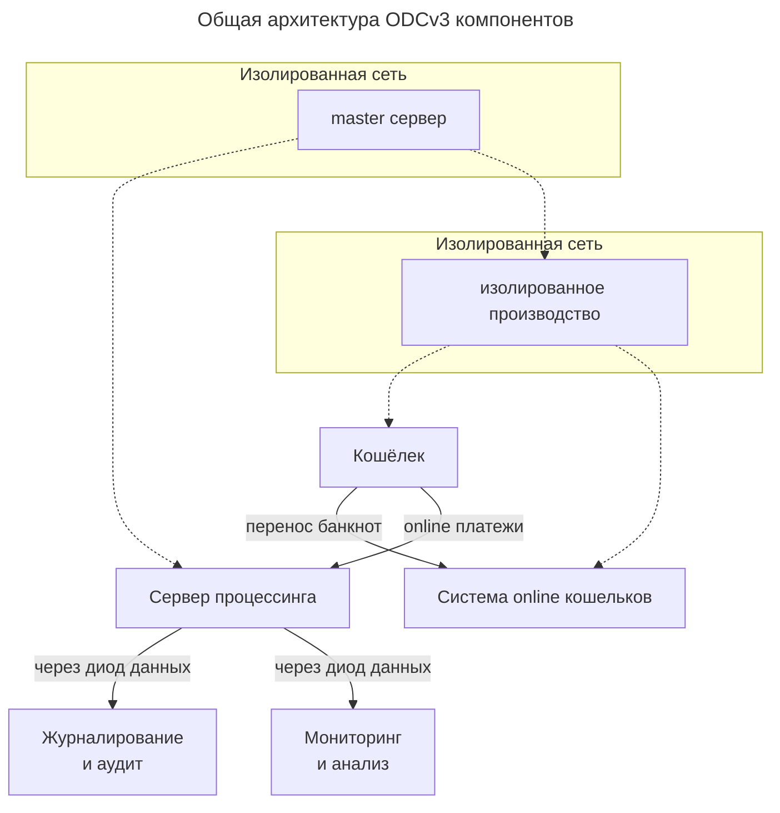

# Общая

## Схема

Прошивка smart карты доверенной среды кошелька,
а так же подписывание и верификация ключей
указана 
*пунктирной* линией.

Задача
[master сервера](bank/master-server.md)
только в подписывание новых 
`bpk` ключей.
Подписи 
*master сервером*
осуществляются только для 
[изолированного производства](bank/production.md)
и для 
[сервера](bank/server.md)
процессинга.

[Изолированное производство](bank/production.md)
осуществляет:
1. Подпись `spk` ключей и прошивку доверенной среды кошелька.
2. Подписывание `spk` ключей для [системы online кошельков](online-wallet-system.md).

[Кошелёк](wallet/index.md)
взаимодействует только 
с процессингом
(online платежи, эксчендж и т.д.)
и между своей парой 
[online кошелька](wallet/online.md)
через
[систему online кошельков](online-wallet-system.md).

Наконец все операции, которые проходят в процессинге, через
[диоды данных](../information-security/data-diod.md) 
помещаются в две системы:
1. [Система мониторинга и анализа](bank/analysis.md)
2. [Система журналирования и аудита](bank/audit.md)

