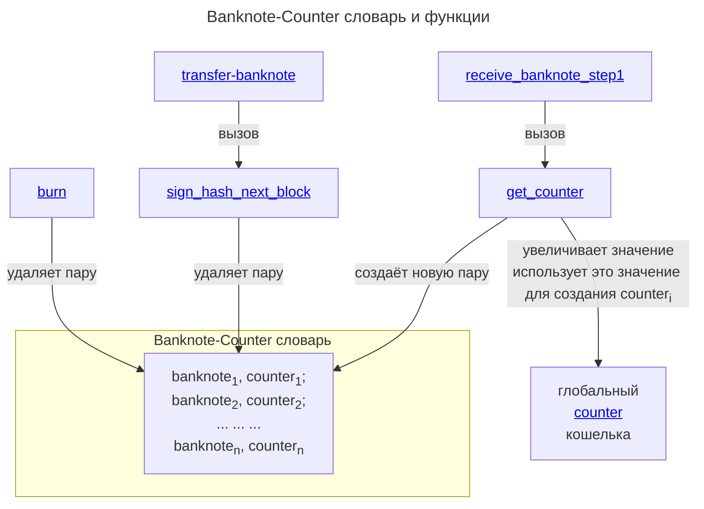

# Banknote-Counter словарь

В доверенной среде
содержится массив значений
вида:
1. `banknote_id`
2. `counter`

Содержится в виде словаря
для быстрого поиска по `banknote_id`.

Этот массив показывает
текущие банкноты,
которыми владеет кошелёк.

В рамках функции
[transfer_banknote](../../functions/transfer-banknote.md)
пара (`banknote_id`, `counter`) удалится.

:::warning[Замечание]
Чем больше банкнот в кошельке,
тем больше данный массив.

Таким образом количество одновременно
существующих банкнот на кошельке
ограничено внутренней памятью
*доверенной среды*.
:::

## Схема

Схематично словарь можно представить в виде:

TODO нарисовать схему

## Создание и удаление записи

Новая запись в 
*Banknote-Counter словаре*
создаётся функцией
[get-counter](../../functions/get-counter.md).

Удаляется запись функцией
[sign_hash_next_block](../../functions/sign-hash-next-block.md)
(вызывается из [transfer_banknote](../../functions/transfer-banknote.md).)

:::note[Замечание]

Так же в случае неудачной транзакции
в 
[алгоритме передачи банкноты](../../banknote/broadcast/algorithm.md)
необходимо очистить данные 
функцией [burn](../../functions/burn.md)
:::

TODO нарисовать разлинчые кейсы