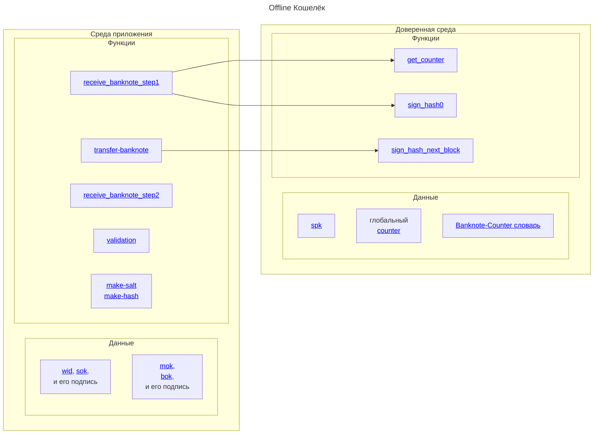

# Кошелёк

offline-кошелёк состоит из двух сред:
1. Среда приложение (например Android приложение)
2. Доверенная среда (например SIM карта)

Среда приложения может быть взломана, 
в этом случае будет нанесён ущерб владельцу кошелька, 
но не банковской системе. 

При взломанной среде приложения 
можно перевести все деньги, лежащие на кошельке
злоумышленникам

Доверенная среда обеспечивает 
[атомарность](../../../dc/money/index.md#атомарная-операция-передачи)
передачи данных.

При взломе доверенной среды,
возможно создание поддельных банкнот
из уже существующих
в рамках offline передачи данных.

## Схема

Схематично offline кошелёк можно представить в виде:

## Online кошелёк

Для online передачи данных и online
кошельков разделене сред не требуется.
Безопасность гарантируется
доверием к
[серверной части](../bank/server.md)
банка-эмитента.

## Среда приложения

В среде приложения 
хранятся все 
[банкноты](../../banknote/index.md).

Среда приложения хранит 
[публичный ключ `mok`](../../information-security/keys.md#mpk-mok),
единый для всей системы.

По отношению к себе самому,
в среде приложения хранятся данные:
1. [`sok`](../../information-security/keys.md#spk-sok) ключ (но не `spk`)
2. [`[hash(sok)](bpk)`](../../information-security/keys.md#spk-sok) -- подпись `sok` ключа банком-эмитентом.

Эти данные уникальны в рамках каждого кошелька.

### bok ключи

В среде приложения хранятся
и множество
троек вида:
1. [`bok`](../../information-security/keys.md#bpk-bok)
2. [`expire`](../../information-security/keys.md#expire)
3. [`[hash(bok; expire)](mpk)`](../../information-security/keys.md#подпись-bok-ключа) -- подтверждение `bok` ключей

Таким образом в
*среде приложения*
есть информация обо всех 
выпущенных `bok`
ключах

### wid

`wid` (**wallet id**) -- это идентификатор кошелька,
создаваемый средой приложения при установки приложения.

В случае переустановки приложения, `wid`
будет сгенерирован снова. 

Таким образом в рамках одного `sok`
может быть несколько `wid`.

## Доверенная среда

Доверенная среда
нужна для offline 
платежей.

Данной средой
может быть код
на SMART карте (в частности SIM карте)

### spk
В доверенной среде храниться ключ `spk`.

Ни при каких 
условиях
он не может быть извлечён из доверенной среды

### counter

Каунтер `counter` -- 
это всегда 
возрастающее число.

:::note[Обратите внимание]
По причине постоянного возрастания
`counter`
всегда уникален для каждого блока
в рамках каждого кошелька.
:::

Оно необходимо для обеспечения 
гарантии единственности
передачи блока данных. 

Благодаря тому, что 
`counter`
всегда уникален для каждого блока 
мы можем гарантировать, 
что процедура
[transfer_banknote](../../functions/transfer-banknote.md)
может быть выполнена только один раз.

:::warning[Замечание]
Теоретически
`counter`
может выйти за 
[диапазон своего значения](https://en.wikipedia.org/wiki/Range_(computer_programming)).

В этом случае произойдёт его обнуление и
`counter` вновь. Что нарушит безопасность системы.

По этой причине при достижении лимита, 
доверенная среда **блокируется**
и уже не может быть использована для приёма новых банкнот.

Однако на практике 64-битное число
дойдёт до своего предела очень не скоро.
:::

### Banknote-Counter словарь

В доверенной среде
содержится массив значений
вида:
1. `banknote_id`
2. `counter`

Содержится в виде словаря 
для быстрого поиска по `banknote_id`.

[Подробнее->](banknote-counter-dict.md)

## online кошелёк

Online кошельки
лежат на 
[сервере](../bank/server.md).

С помощью приложения
осуществляется доступ к 
онлайн-кошельку,
но не передаётся контроль за самими 
[банкнотами](../../banknote/index.md).

В рамках online
кошелька можно совершать
только online операции.

При отсутствии доступа в Интернет,
вы не можете расплачиваться 
ODC банкнотами.

Однако в online кошельке
нет проблем, связанные
с *доверенной средой*.
В частности вы можете хранить 
неограниченное количество банкнот
в онлайн кошельке.

:::note[Обратите внимание]
На практике разумно 
для каждого пользователя 
создать два кошелька:
1. offline
2. online

Внутри *среды приложения*
сделать функцию мониторинга,
которая будет 
"поддерживать"
необходимое количество цифровых наличных
на offline кошельке.
:::