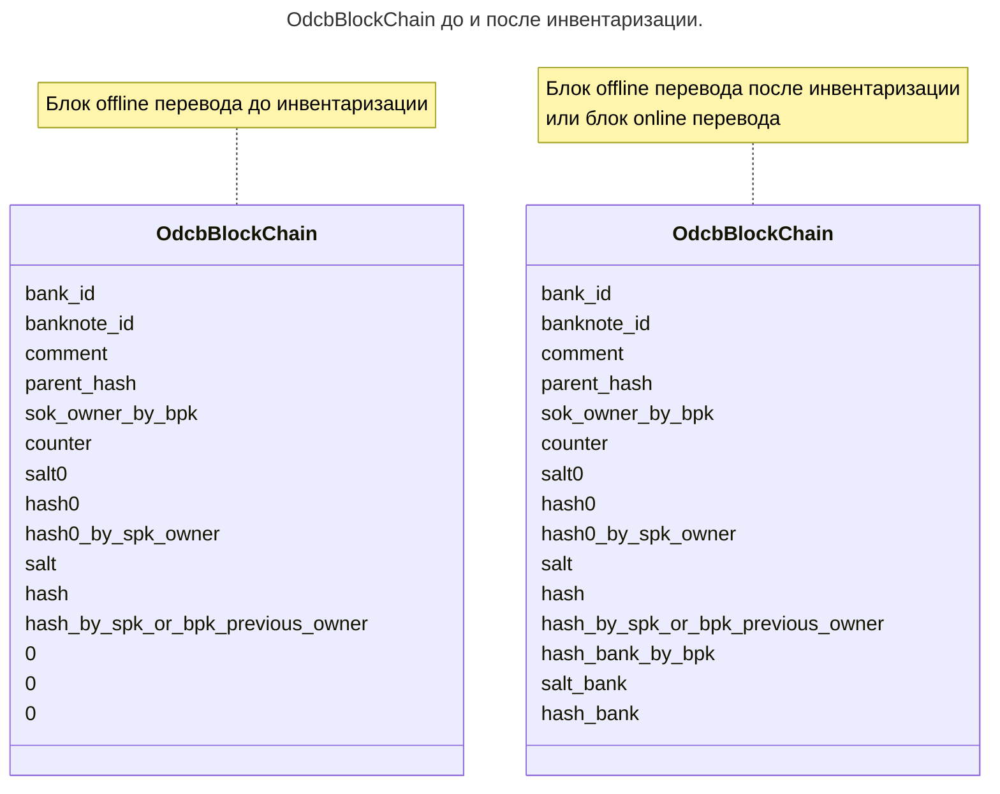

# inventory

Функция
среды приложения кошелька

**inventory** (инвентаризация) --
функция, 
вызываемая при доступе в Интернет.

Данная функция отправляет 
все offline банкноты 
на дополнительное подтверждение банком.

:::tip[Обратите внимание]

Мобильные устройства 
Android
iPhone
и другие
могут иметь доступ в сеть Интернет
через wi-fi сети доступа
(а через них к "классическим" недорогим провайдерам)
или через мобильную сеть,
которая, как правило, стоит дороже.

Пользователи таких устройств
могут в настройках указать 
приоритет использования
мобильного интернета вашего кошелька.

Обратите внимание, что
при получении offline
денег, пользователь несёт риски,
но при выдаче -- не несёт.

Протокол ODCv3 не регламентирует
поведение *среды приложения* кошелька,
но рекомендует 
проводить функцию **inventory**
как только появится возможность мобильного интернета.
:::

## Алгоритм

1. Получить список всех банкнот, полученных или отправленных offline методом.
2. Передать все блоки `OdcbBlockChain` у которых отсутствуют поля `hash_bank_by_bpk` (и соответственно `salt_bank` и `hash_bank`) на инвентаризацию на [сервер](../architecture/bank/server.md).
   * см. [inventory функцию сервера](inventory_server.md)
3. Прописать значения  `hash_bank_by_bpk`, `salt_bank` и `hash_bank`.
4. Удалить ненужные `sok` и их подписи, которые хранились для offline платежей
5. Удалить все промежуточные `OdcbBlockChain`, кроме последнего.

:::note[Замечание]

В п.5 алгоритма удаляются все 
[`OdcbBlockChain`](../banknote/block-chain.md)
блоки, кроме последнего.

Блоки
[`OdcbBlockHeader`](../banknote/header.md)
и все блоки
[`OdcbBlockApplicability`](../banknote/applicability.md)
остаются на месте.
:::

