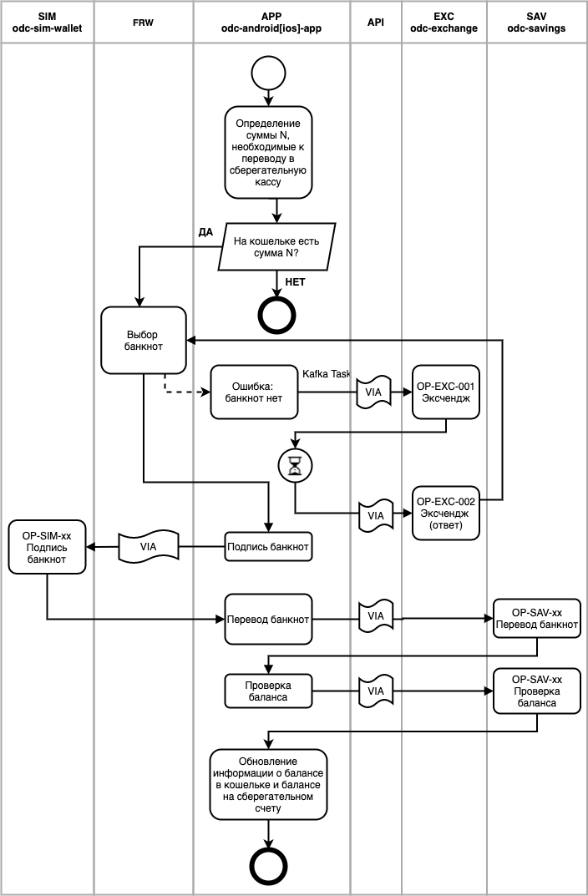

# SC181 Передача банкнот в сберегательную кассу

## Действия

| № | Описание | Исполнитель | Операция                                                                             |  
| --- | ---- | ---- |--------------------------------------------------------------------------------------|
|1| Определение суммы N, необходимые к переводу с сберегательную кассу | APP | –                                                                                    |
|2| На кошельке есть сумма N? Если нет – ошибка и конец алгоритма | APP | –                                                                                    
|3| Выбор банкнот для суммы N | FRW | [OP-FRW-001](../operations/frw/001.md)                                               |
|4| Есть необходимые банкноты? | APP | 
|5| Если нет -- эксчендж | API -> EXC | [OP-EXC-001](../operations/exc/001.md),   [OP-EXC-002](../operations/exc/001.md) |
|6| Подпись банкнот | FRW -> SIM | OP-SIM-xx                                                                            |
|7| Перевод банкнот | API -> SAV| OP-SAV-xx                                                                            |
|8| Проверка баланса сберегательной кассы | API -> SAV | OP-SAV-xx                                                                            |
|9| Обновление информации о балансе (наличные, касса) | APP| –                                                                                    |

## Диаграмма

