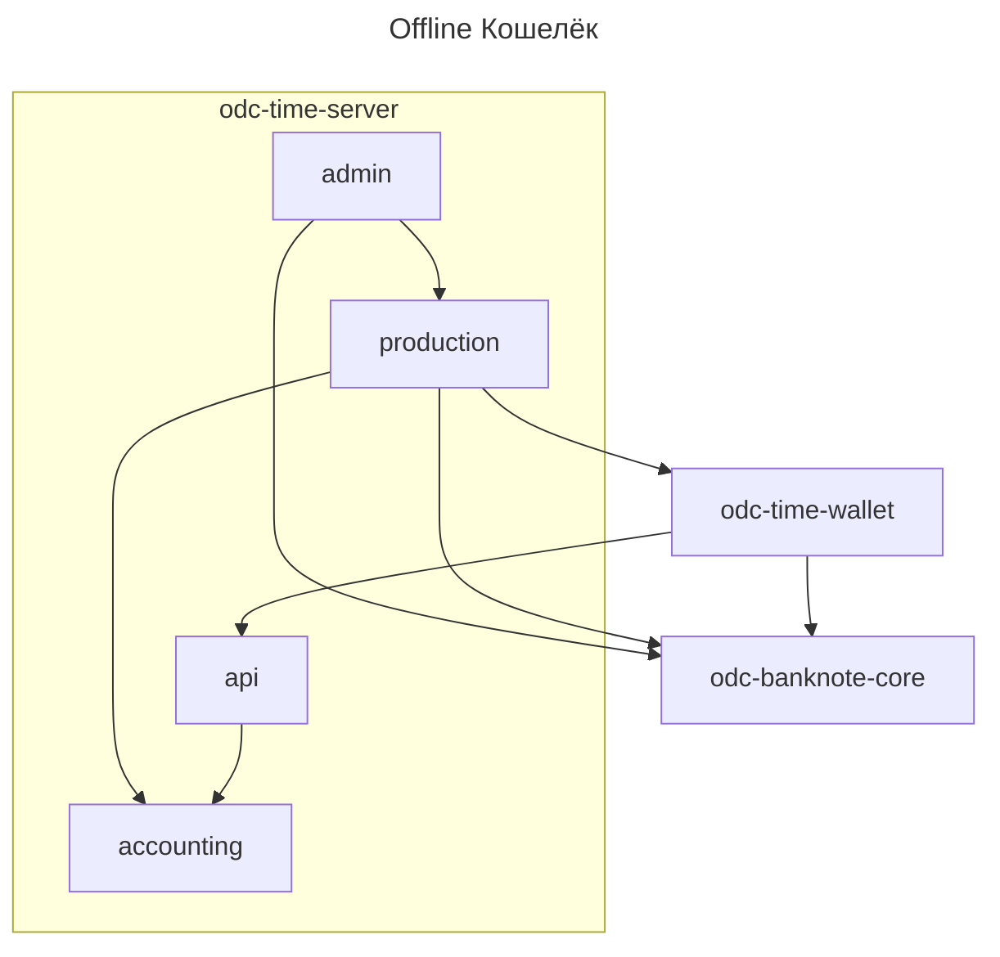

# Архитектура

Архитектура Time Money 
и ODC v2.5 протокола

:::tip[Замечание]

ODCv2.5 во многом похож на
[ODCv3](../../project3/intro.md) 
протокол.

Cм. отличия тут: ... TODO
:::

## odc-time-wallet

Основной кошелёк. 

Представлен на двух платформах:
* Android
* iOS

А так же в виде Telegram приложения
(Web 3.0)

См. ...

## odc-time-server 

Основной сервер для 
Time Money.

Состоит из трёх равноправных серверов
с `mpk`\\`mok` ключами.

Каждый состоит из трёх компонентов:
1. api -- публичное REST API 
1. admin -- админ-панель. Доступ через SSH туннель из bash консоли 
1. production -- производство новых кошельков, денег
1. accounting -- учёт денег при онлайн подтверждении, эксчендж денег.

Так же каждый сервер содержит у себя 
сервисный кошелёк.

## odc-banknote-core

Публичная библиотека всех мат.функций.

:::danger[Замечание]
В рамках ODCv2.5 никак не решается 
проблема доверенной среды.

Данный протокол реализует клубные деньги,
в рамках которого все друг друга знают. 

В случае взлома кошелька данный факт будет быстро обнаружен,
злоумышленник будет исключён из движения.

См. подробнее тут:
TODO
:::
