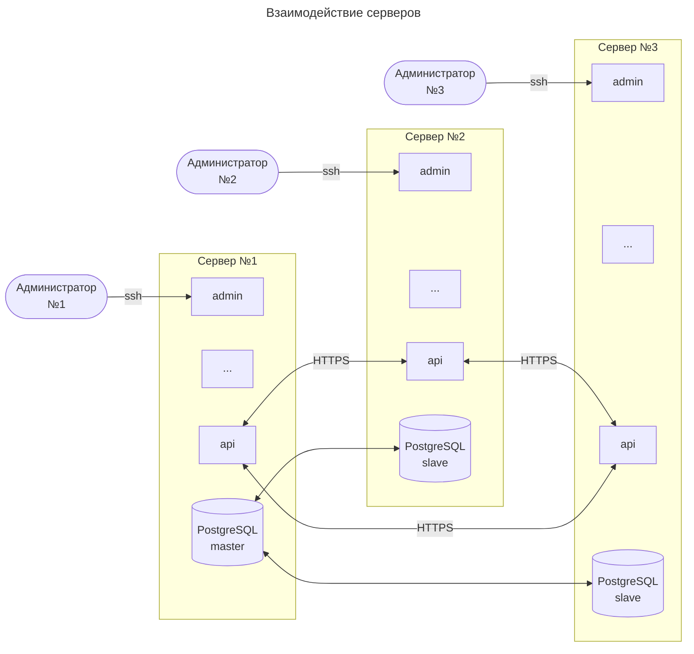

# Сервер

Серверная часть используется для:
1. администрирования
   1. Создание новых кошельков
   2. Эмиссия новых денег
   3. Блокировка кошельков
   4. Блокировка денег
2. процессинга
   1. подпись банка и сокращение блокчейна
   2. эксчендж
3. доступ к онлайн-кошелькам
4. мониторнинг и анализ

## Три сервера

Для работы ODC 2.5 протокола требуются 
**три** 
независимых сервера.

Каждый из серверов имеет свою локальную базу данных
PostgreSQL,
одна из которых является 
`master`,
другие 
`slave`

В случае рассинхронизации серверов
(по команде в случае подозрения компрометации)
все БД становятся `master`.

